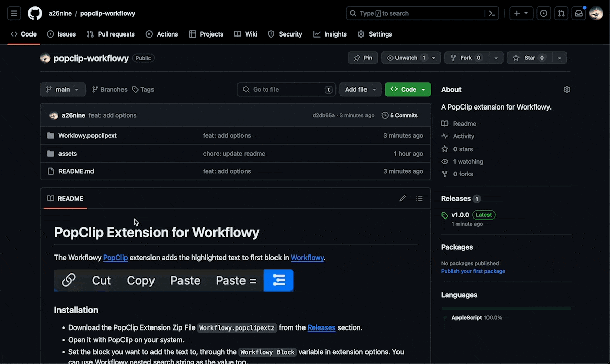

# PopClip Extension for Workflowy

The Workflowy [PopClip](https://www.popclip.app/) extension adds the highlighted text to first block in [Workflowy](https://workflowy.com/).

### Installation

- Download the PopClip Extension Zip File `Workflowy.popclipextz` from the [Releases](https://github.com/a26nine/popclip-workflowy/releases) section.
- Open it with PopClip on your system.
- Set the block you want to add the text to, through the `Workflowy Block` variable in extension options. You can use Workflowy nested search string as the value too.
  - Default: `Inbox > PopClip`
  - If the block doesn't exist, the text will be added to the root/home block.
- Voila! You can now send text using PopClip to Workflowy! 🎉
